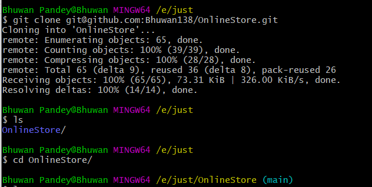

# TITLE: Technology Used and How to run the program locally.

## All Technology Used

1. React
2. ReduxToolkit
3. React-Router
4. Bootstrap/ React-Bootstrap
5. React Query (Tanstack query) -> (axios)
6. React Loading Skeleton

## How to run the program locally.

1. Fork the https://github.com/Bhuwan138/OnlineStore/ project repository to your profile and clone it to your machine to begin the project.
   git clone git@github.com:Bhuwan138/OnlineStore.git
   cd OnlineStore/
   

2. Install the dependencies node module
   npm i
3. Run the project
   npm run dev
4. Open the website on browser by navigating the the localhost link
   http://localhost:5173/
